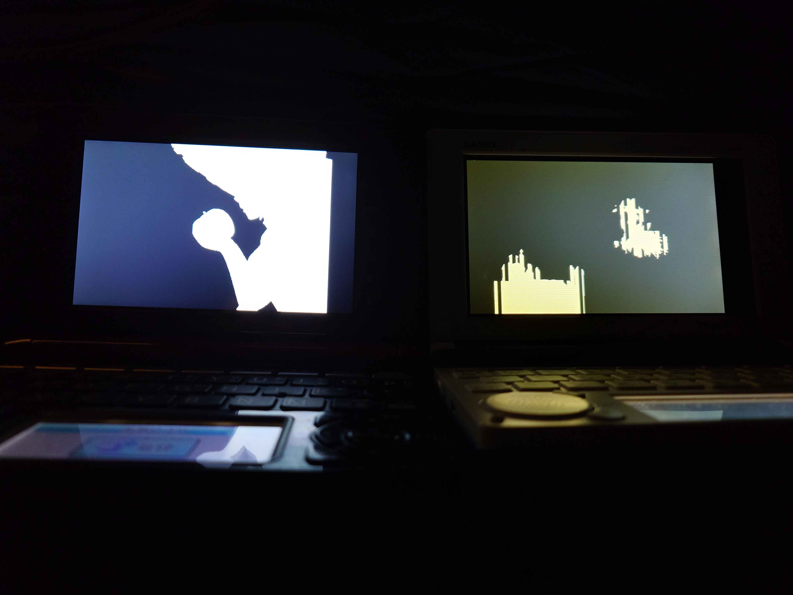
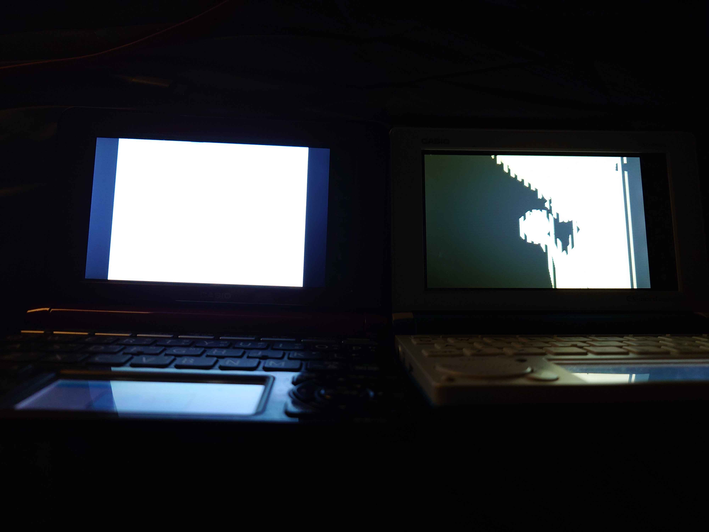

# EX-word DATAPLUS BadApple Player




This is a technical demo for CASIO EX-word DATAPLUS 5/6/7 that plays a black-and-white video (originally made for [Bad Apple!!](https://en.wikipedia.org/wiki/Bad_Apple!!)) on the device's own LCD, streamed frame-by-frame from storage. `src/faketerminal/` implements a small terminal shell on the device; typing `play <file.bin>` decodes and plays back a video packed in the custom BAPX container described below. The project also ships with GitHub Actions build on tag push and manual dispatch.

You can install the app to your EX-word device in the same way as [Gnuboy EX](https://brain.fandom.com/ja/wiki/Gnuboy_EX) by using the [libexword](https://brain.fandom.com/ja/wiki/Libexword) tool. For local setup, install the [devkitSH4](https://brain.fandom.com/ja/wiki/devkitSH4) compiler and invoke `make` to build in `build/ja/` and `build/cn/`. devkitSH4 automatically downloads [libdataplus](https://github.com/brijohn/libdataplus) during the installation process.

- `html/`: Metadata HTML templates to be read by the EX-word system (must be in CRLF)
- `src/`: C source files
  - `src/libc/`: libc subset implementation found in [Gnuboy EX](https://github.com/brijohn/gnuboy-ex)
  - `src/faketerminal/`: on-device shell, terminal UI, and the BAPX video player (`bapx.c`)
- `resources/`: tools to turn a source video into a BAPX file the device can play (see below), plus an SDL2 host build of the same decoder for debugging

App name etc. are set in `TARGET`, `MODNAME`, `APPTITLE`, and `APPID` in `Makefile`. `APPTITLE` is the app name displayed on EX-word, and `APPID` is the app-specific identifier (5 uppercase letters). The details of the others are currently unknown.

As this repository is based on GPL-2.0 licensed [Gnuboy EX](https://github.com/brijohn/gnuboy-ex), we license this repository in [GPL-2.0](COPYING) as required.

This repository is inspired by [yukkuri-Dev/EXtend-Word](https://github.com/yukkuri-Dev/EXtend-Word), and the automatic build uses a prebuilt toolchain distributed at [MaxSignal/buildscripts](https://github.com/MaxSignal/buildscripts).

## Preparing a BAPX video (`resources/`)

`resources/pack.py` converts a raw RGB565 stream into the BAPX container played by `play` (`src/faketerminal/bapx.c`). Encode with `ffmpeg` and pipe straight into `pack.py`:

```
ffmpeg -i input.mp4 \
  -vf "fps=30,scale=428:320:force_original_aspect_ratio=decrease:flags=area" \
  -f rawvideo -pix_fmt rgb565le - | python3 pack.py badapple.bin -W 428 -f 30
```

Don't add letterboxing (no `pad`). 428 is chosen so that, on the 528-wide screen, the left margin comes out to 50 (even) — the decoder's alignment fixup then never has to run on any row.

To sanity-check the pipeline once, add `--verify` — it re-decodes every frame and compares it back, so it's slower. Use it only on the first run and drop it for subsequent re-encodes:

```
python3 pack.py badapple.bin -W 428 -f 30 --verify < raw.rgb565le
```

To estimate the output size beforehand with `estimate.py`:

```
ffmpeg -i input.mp4 \
  -vf "fps=30,scale=428:320:force_original_aspect_ratio=decrease:flags=area" \
  -f rawvideo -pix_fmt rgb565le - | python3 estimate.py --src-fps 30 -W 428
```

---
The converted data must be transferred to the device.
Please transfer the data using [libexword](https://brain.fandom.com/ja/wiki/Libexword) or [libexword-next](https://github.com/yukkuri-Dev/libexword-next), which features a simple GUI.

> [!WARNING]
> Overclocking code has been implemented by modifying the LLP in gnuboy-ex.
> It appears to work without issues based on my testing, but I am mentioning this just to be safe.

# EX-word DATAPLUS BadApple プレイヤー

このリポジトリは、CASIO 製電子辞書 EX-word DATAPLUS 5/6/7 の実機画面上で、白黒動画（もともと [Bad Apple!!](https://ja.wikipedia.org/wiki/Bad_Apple!!) 用に作った素材）をストレージから1フレームずつストリーミング再生するための技術デモです。`src/faketerminal/` が本体上で動く簡易ターミナルシェルを実装しており、`play <file.bin>` と入力すると、下記の BAPX 独自コンテナに詰めた動画をデコード・再生します。tag の push や手動発行で GitHub Actions ビルドも走ります。

[libexword](https://brain.fandom.com/ja/wiki/Libexword) ツールを使えば [Gnuboy EX](https://brain.fandom.com/ja/wiki/Gnuboy_EX) と同様の方法で EX-word にインストールできます。ローカル環境では、[devkitSH4](https://brain.fandom.com/ja/wiki/devkitSH4) コンパイラを導入して `make` すると `build/ja/` と `build/cn/` 以下にビルドされます。devkitSH4 のインストール時に [libdataplus](https://github.com/brijohn/libdataplus) も同時にインストールされます。

- `html/`: EX-word システムが使用するメタデータを記載した HTML テンプレート（CRLF 必須）
- `src/`: C ソースファイル
  - `src/libc/`: [Gnuboy EX](https://github.com/brijohn/gnuboy-ex) に含まれる libc のサブセット実装
  - `src/faketerminal/`: 実機上のシェル・ターミナル UI・BAPX 動画プレイヤー（`bapx.c`）
- `resources/`: 動画ファイルを実機で再生可能な BAPX 形式に変換するツール一式（後述）と、同じデコーダをデバッグ用に SDL2 で host 上でも動かせるようにしたもの

アプリ名などは `Makefile` の `TARGET`, `MODNAME`, `APPTITLE`, `APPID` で設定されています。`APPTITLE` が EX-word 上で表示されるアプリ名、`APPID` がアプリ固有の識別子（英大文字 5 文字）ですが、それ以外は現時点で詳細不明です。

GPL-2.0 でライセンスされている [Gnuboy EX](https://github.com/brijohn/gnuboy-ex) プロジェクトをベースに作成しているため、その規定に従い本リポジトリも [GPL-2.0](COPYING) でライセンスします。

本リポジトリは [yukkuri-Dev/EXtend-Word](https://github.com/yukkuri-Dev/EXtend-Word) に着想を得ており、自動ビルドは [MaxSignal/buildscripts](https://github.com/MaxSignal/buildscripts) で配布されているビルド済みツールチェインを使用しています。

## BAPX動画の準備 (`resources/`)

`resources/pack.py` は生の RGB565 ストリームを、`play`（`src/faketerminal/bapx.c`）が再生する BAPX コンテナに変換します。`ffmpeg` でエンコードして `pack.py` にそのままパイプします。

```
ffmpeg -i input.mp4 \
  -vf "fps=30,scale=428:320:force_original_aspect_ratio=decrease:flags=area" \
  -f rawvideo -pix_fmt rgb565le - | python3 pack.py badapple.bin -W 428 -f 30
```

黒帯は付けない（`pad` なし）。428 は 528 幅の画面に対して左マージン 50（偶数）になるので、デコーダのアライメント補正が毎行走らずに済む値。

必要なら確認用に一度だけ流して:

```
python3 pack.py badapple.bin -W 428 -f 30 --verify < raw.rgb565le
```

`--verify` を付けると全フレームをデコードし直して照合するので遅くなる。初回だけ付けて、以降の再エンコードでは外していい。

`estimate.py` で先に容量を見たいなら:

```
ffmpeg -i input.mp4 \
  -vf "fps=30,scale=428:320:force_original_aspect_ratio=decrease:flags=area" \
  -f rawvideo -pix_fmt rgb565le - | python3 estimate.py --src-fps 30 -W 428
```
変換したデータは本体内に転送する必要があります
[libexword](https://brain.fandom.com/ja/wiki/Libexword)を利用して転送するか、簡易的なGUIを搭載した[libexword-next](https://github.com/yukkuri-Dev/libexword-next)を利用して転送してください

> [!WARNING]
> gnuboy-exに実装されているLLPを変更することで行うOverClockコードが実装されています、
> 検証している限りでは問題ありませんが、念のため